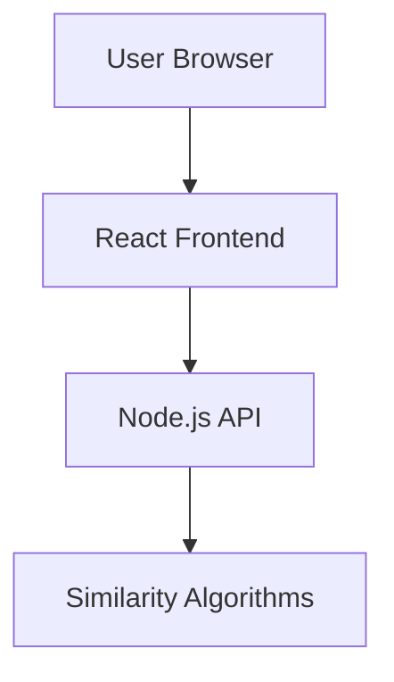

### **1. Root Folder Structure**
```
doc-similarity/
├── doc-similarity-frontend/          # React app
├── doc-similarity-backend/           # Node.js API
├── README.md          # Main documentation
└── .gitignore
```

---

### **2. Root README.md**  
*(General overview for the entire project)*

```markdown
# Document Similarity System

A full-stack solution for comparing text document similarity with:
- React frontend
- Node.js backend
- Multiple comparison algorithms

## Quick Start

1. **Clone repository**:
```bash
git clone https://github.com/yourusername/doc-similarity.git
cd doc-similarity
```

2. **Start both services**:
```bash
# Backend
cd backend && npm install && npm run dev

# Frontend (in new terminal)
cd frontend && npm install && npm start
```

## System Architecture


## Documentation
- [Frontend Guide](./frontend/README.md)
- [Backend Guide](./backend/README.md)

## Deployment
[](https://render.com/deploy)

## License
MIT
```

---

### **3. Frontend/README.md**  
*(Detailed frontend-specific instructions)*

```markdown
# Document Similarity Frontend

React-based UI for comparing text documents.

## Features
- Drag-and-drop file upload
- Real-time similarity scores
- Performance metrics

## Installation
```bash
cd frontend
npm install
```

## Configuration
Create `.env`:
```ini
REACT_APP_API_URL=http://localhost:3001
```

## Available Scripts
- `npm start`: Local development
- `npm build`: Production build

## Deployment
[](https://vercel.com/new)
```

---

### **4. Backend/README.md**  
*(Detailed backend-specific instructions)*

```markdown
# Document Similarity API

Node.js backend for document comparison.

## Features
- Cosine/Jaccard/Minhash algorithms
- File processing pipeline
- Rate limiting

## Installation
```bash
cd backend
npm install
```

## Configuration
Create `.env`:
```ini
PORT=3001
MAX_FILE_SIZE=5MB
```

## Endpoints
| Method | Endpoint | Description          |
|--------|----------|----------------------|
| POST   | /compare | Compare two documents|

## Deployment
[](https://railway.app/new)
```

---

### **Why This Structure Works**
1. **Root README** gives **global context** and **quick start**
2. **Sub READMEs** handle **tech-specific details**
3. **Modular documentation** prevents information overload
4. **Deployment buttons** encourage quick hosting
5. **Mermaid diagram** explains architecture visually

---

### **Additional Recommendations**
1. Add these badges to root README:
```markdown


```

2. Include an **example.env** in both directories:
```bash
# backend/example.env
PORT=3001
MAX_FILE_SIZE=5MB

# frontend/example.env
REACT_APP_API_URL=http://localhost:3001
```
